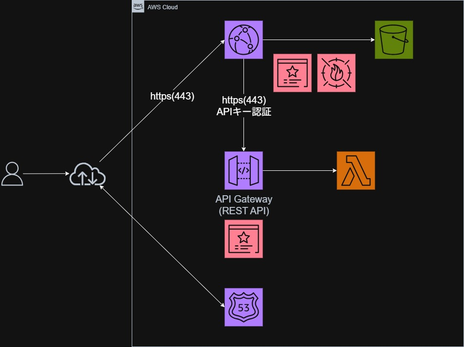

学習のために構築した環境です。

# 目次

* [1. 実装要件](#1-実装要件)
* [2. 本構成のメリット](#2-本構成のメリット)
* [3. 設計思想と技術選定のポイント](#3-設計思想と技術選定のポイント)
* [4. 構築時の注意点](#4-構築時の注意点)
* [5. 参照](#5-参照)

# 1. 実装要件

下記を実装し動作させることが今回の学習目的です。

 * 静的フロントエンド： S3 + CloudFront
 * 動的処理（API）： API Gateway + Lambda
 * セキュリティ： AWS WAF による保護、ACMによるHTTPS化
 * 認証： CloudFrontからAPI GatewayへAPI Keyを付与してバックエンドを保護
 * 管理： TerraformによるInfrastructure as Code (IaC)

セキュリティを意識しつつ、サーバーレスで一般的に使われている構成にしました。

---

# 2. 本構成のメリット

 * CloudFront をS3, API Gateway前段に配置
   * セキュリティ向上: OAC（Origin Access Control）によるS3の完全非公開化と、AWS WAFの一括適用が可能
   * パフォーマンス: 世界各地のエッジロケーションでのキャッシュによる高速配信
   * ドメイン統合: S3とAPI Gatewayのドメインを1つに集約し、CORS問題を回避
 * サーバーレス（API Gateway + Lambda）の採用
   * 運用負荷の軽減: サーバーのOS管理やパッチ当てが不要になり、管理コストを最小化
   * 高いスケーラビリティ: リクエスト量に応じて自動でスケーリングされるため、急なトラフィック増にも柔軟に対応  

---
# 3. 設計思想と技術選定のポイント

## 3-1. 多層防御によるセキュリティ設計

 * S3の完全非公開化とWAF保護
   OACを利用してS3への直接アクセスを遮断し、CloudFrontを経由したアクセスのみを許可。すべてのWebトラフィックにAWS WAFを強制適用し、設定ミスによる情報流出リスクを排除しました。
 * バックエンド（Lambda）の多層防御
   * APIキー認証と利用プラン: 特定のキーを持つユーザーのみが、定義されたレート制限（スロットリング）の範囲内で実行できる仕組みを導入。
   * 最小権限の原則: Lambdaのリソースベースポリシーにより、「API Gatewayの特定のパス・メソッドからの呼び出しのみ」を明示的に許可し、不正な実行を防止。
 * トラフィック制御による保護
   Usage Plan（利用プラン）によるレート制限（例：100 req/sec）を設定。DDoS攻撃や予期せぬアクセス集中によるコスト増加やバックエンドのパンクを未然に防ぎます。
 * オリジン直叩きの防止（X-Origin-Verify）
   API GatewayのURLが漏洩した場合に備え、CloudFrontからカスタムヘッダーを付与し、WAFでその値を検証。正規ルートを経由しないアクセスをインフラレベルで遮断します。
   
## 3-2. ネットワーク設計
 * APIエンドポイントの構成
   CloudFrontが前段に控えているため、API Gatewayは「REGIONAL」タイプを選択しました。
 * Route 53 Aliasレコードの活用​
Zone Apex（ドメイン名そのもの）でCloudFrontを利用可能にするため、CNAMEではなくRoute 53のAlias機能を利用しています。これにより、ドメイン名を直接CloudFrontのディストリビューションに関連付けています。
## 3-3. パフォーマンス最適化

 * パスベースのキャッシュ戦略
   静的コンテンツ（S3）はエッジでキャッシュさせて高速化。一方、動的データ（API）はキャッシュを無効化（Managed-CachingDisabled）し、常に最新データを返すよう制御しました。
   
## 3-4. IaC（Terraform）による管理

 * 自動デプロイの整合性担保
   REST APIやLambdaコードの変更をハッシュ値（triggers / source_code_hash）で検知。修正後の terraform apply で最新の状態が反映されるようにしました。
 * ゼロダウンタイムでの更新
   create_before_destroy ライフサイクルを活用し、リソース更新時に新しいものを作成してから古いものを消す設定にしています。
   
---   
# 4. 構築時の注意点
実装にあたって特に注意すべき、Terraform構築時に反映されない原因などを4点にまとめました。
 * CloudFront の ACM は必ず us-east-1
   メインの構築リージョンが東京（ap-northeast-1）であっても、CloudFrontに関連付ける証明書だけはバージニア北部で作成する必要があります。
 * API Gateway は Deployment を明示的に作らないと反映されない
   API Gatewayは「編集中の設定」と「公開済みの設定（ステージ）」が分離されているため、明示的なデプロイ操作が不可欠です。
 * 変更検知用に triggers を活用する
   aws_api_gateway_deployment 内で triggers ブロックを使い、メソッドやLambdaのIDを監視しましょう。これがないと、Terraform側でコードを書き換えてもAPI Gateway側が再デプロイされず、古い挙動が残ります。
 * キャッシュ挙動はパス単位で分ける
   * 静的コンテンツ (/index.html, /static/*): CloudFrontにキャッシュさせる（Managed-CachingOptimized）。
   * APIリクエスト (/data): キャッシュを無効化する（Managed-CachingDisabled）。  

---

# 5. 参照
[CloudFrontドキュメント](https://docs.aws.amazon.com/ja_jp/cloudfront/?id=docs_gateway)

[APIGatewayドキュメント](https://docs.aws.amazon.com/ja_jp/apigateway/latest/developerguide/api-gateway-documenting-api.html)

[S3ドキュメント](https://docs.aws.amazon.com/ja_jp/s3/?icmpid=docs_homepage_featuredsvcs)

[Lambdaドキュメント](https://docs.aws.amazon.com/ja_jp/lambda/?icmpid=docs_homepage_featuredsvcs)

[Terraformドキュメント](https://registry.terraform.io/providers/hashicorp/aws/latest/docs)
